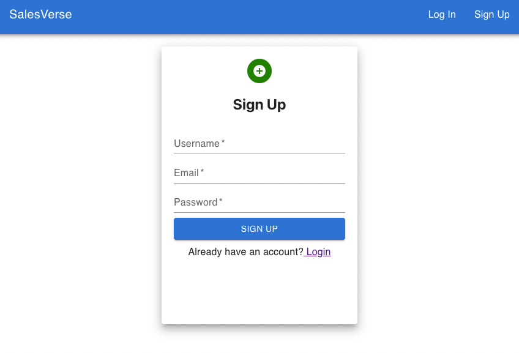
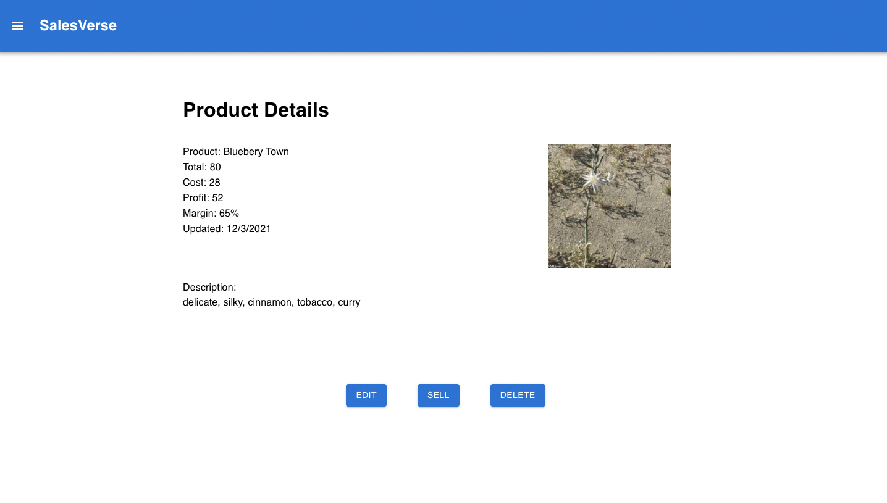
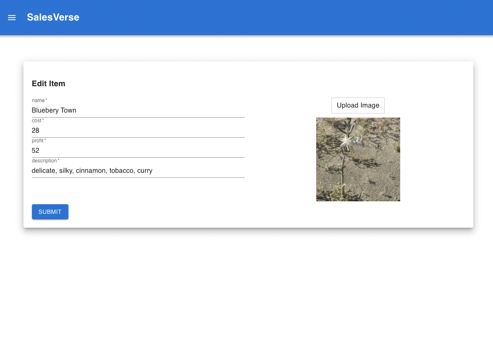
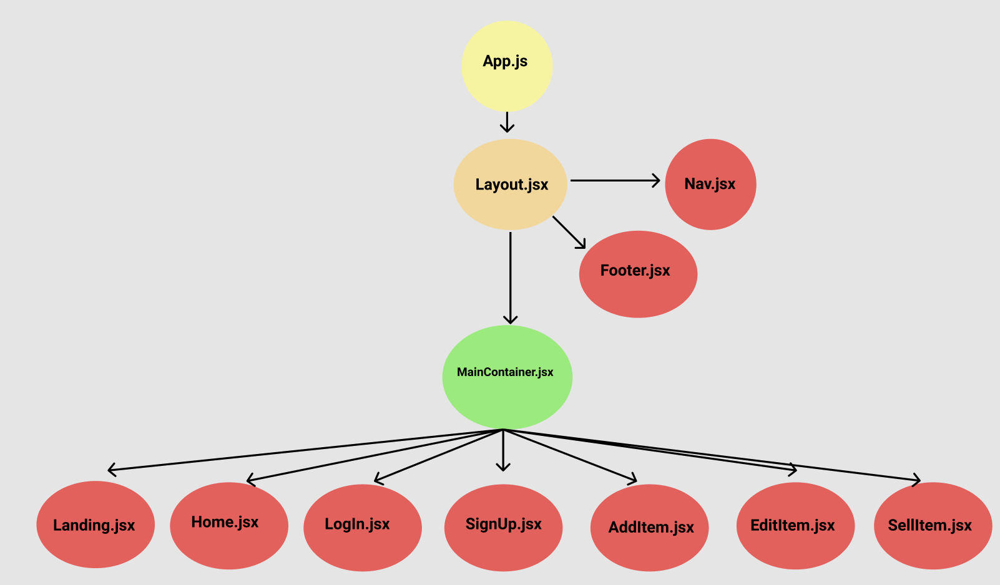
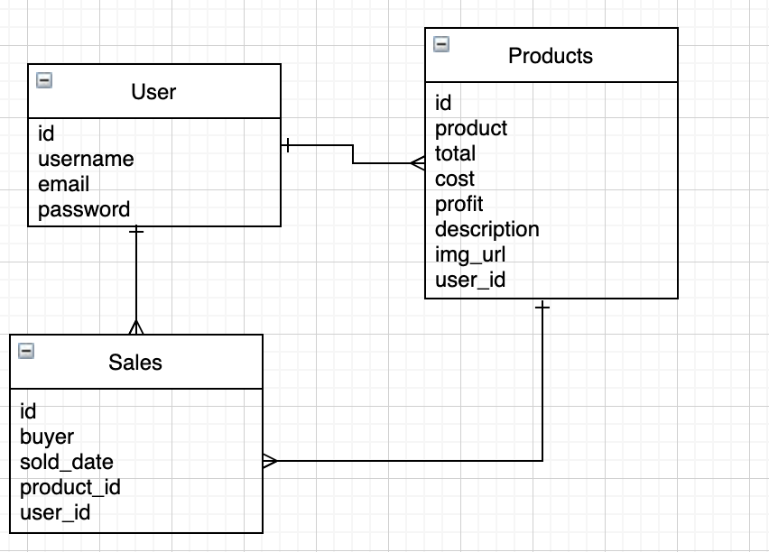

# SalesVerse <!-- omit in toc -->
# [Click to view deployed site](https://salesverse.netlify.app/)

- [Overview](#overview)
- [MVP](#mvp)
  - [Goals](#goals)
  - [Libraries and Dependencies](#libraries-and-dependencies)
  - [Client (Front End)](#client-front-end)
    - [Wireframes](#wireframes)
    - [Component Tree](#component-tree)
    - [Component Architecture](#component-architecture)
    - [Time Estimates](#time-estimates)
  - [Server (Back End)](#server-back-end)
    - [ERD Model](#erd-model)
- [Post-MVP](#post-mvp)
- [Code Showcase](#code-showcase)


<br>

## Overview

_**SalesVerse** is the small business sales coordinator that will get your team on track and up to date. This program will hold all the info on the items you sell as well as displaying margin and other important info needed when deciding a price. In addition it will display over all stats based on revenue and percent growth. You can invite everyone on your team so that everyone can see how eachother are doing._


<br>

## MVP


_The **SalesVerse** MVP will consist of a react frond end and rails backend. The backend with contain three seperate tables, a user table, products table and a sales table._

<br>

### Goals

- Create a clean interface that is simple to use.
- Display the data that is important to the business.
- Easy access to data that wasn't already accesible


<br>

### Libraries and Dependencies


|     Library      | Description                                |
| :--------------: | :----------------------------------------- |
|      React       | Front end framework.|
|   React Router   | Create routing in the app.|
| Material UI | Elegant Styling. |
|     Ruby on Rails     | Backend framework.|


<br>

### Client (Front End)

#### Wireframes


- Desktop Sign Up


- Desktop Product List


- Product Details



- Product Edit Page




[Full Wireframe here](https://www.figma.com/file/eywNmVbpBVpSdbPavkAIx8/SalesVerse?node-id=0%3A1)


#### Component Tree




#### Component Architecture


``` structure

src
|__ screens/
      |__ Landing.jsx
      |__ Home.jsx
      |__ LogIn.jsx
      |__ SignUp.jsx
      |__ AddItem.jsx
      |__ EditItem.jsx
      |__ SellItem.jsx
      
|__ components/
      |__ Header.jsx
      |__ Footer.jsx
      |__ Nav.jsx
      |__ ProductList.jsx
      |__ ProductDetails.jsx
      |__ Search.jsx

|__ services/

|__ utils/
      |__ Sort.js


```

#### Time Estimates


| Task                | Priority | Estimated Time | Time Invested | Actual Time |
| ------------------- | :------: | :------------: | :-----------: | :---------: |
| Backend Full CRUD    |    H    |     3 hrs      |        |      |
| Create React App (install dependencies|    H     |     3 hrs      |       |        |
| Create CRUD Front End               |          |     3 hrs      |         |       |
| Set up file skeleton              |          |     3 hrs      |        |         |
| Set up Routes            |          |     2 hrs      |         |        |
| Build screens and components            |          |     6 hrs      |         |         |
| Set up axios requests to back end          |          |     2 hrs      |         |         |
| CSS MVP Features          |          |     6 hrs      |         |         |
| Add user authentication          |          |     6 hrs      |         |         |
| TOTAL          |          |     34 hrs      |         |         |


<br>

### Server (Back End)

#### ERD Model



<br>

***

## Post-MVP

- User Authentication
- User Roles
- Inventory
- Teams
- Goal Tracking
- More Data Visualization
***

## Code Showcase
  ```
  const [formData, setFormData] = useState({
    username: '',
    email: '',
    password: '',
  })

  const { username, email, password } = formData
  const { handleSignup } = props

  const handleChange = (e) => {
    const { name, value } = e.target;
    setFormData((prevState) => ({
      ...prevState,
      [name]: value,
    }));
  };
  ```


